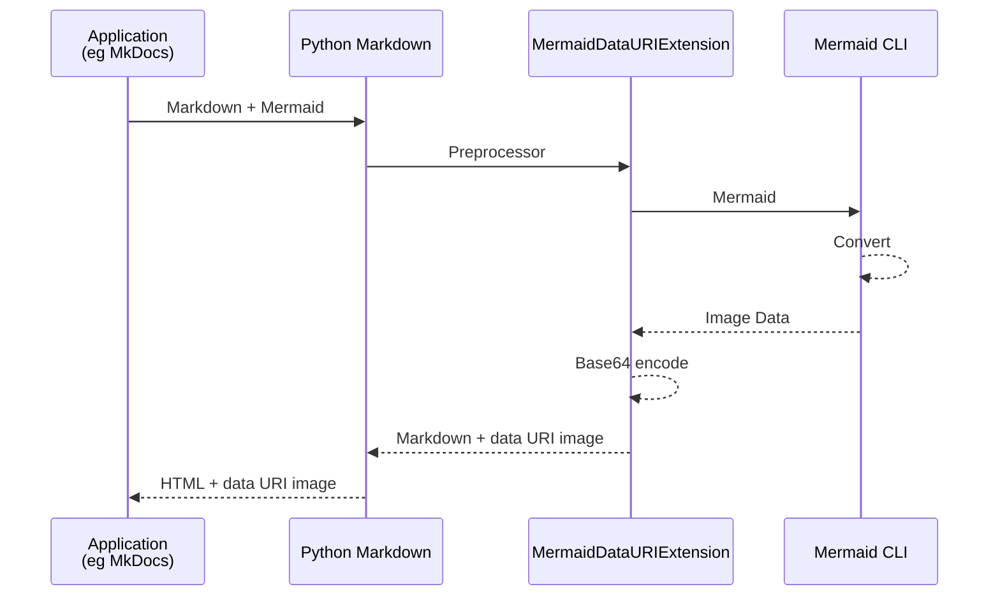

# markdown-mermaid-data-uri

[Mermaid](https://mermaid.js.org/) extension for [Python-Markdown](https://python-markdown.github.io/) using [mermaid-cli](https://github.com/mermaid-js/mermaid-cli).

Mermaid code blocks are converted to SVG/PNG and treated as [data: URI](https://developer.mozilla.org/en-US/docs/Web/URI/Reference/Schemes/data). This allows for PDF generation with tools like [WeasyPrint](https://weasyprint.org/) without the need for JavaScript, even during web browsing.

## Install

```sh
pip install git+https://github.com/hkato/markdown-mermaid-data-uri.git
```

```sh
npm install @mermaid-js/mermaid-cli
```

## Usage

````python
import markdown
from mermaid_data_uri.extension import MermaidDataURIExtension

markdown_text = """```mermaid
sequenceDiagram
    participant Alice
    participant Bob
    Bob->>Alice: Hi Alice
    Alice->>Bob: Hi Bob
```"""

html_output = markdown.markdown(markdown_text, extensions=[MermaidDataURIExtension()])
print(html_output)
````

```html
<p></p>
```

## MkDocs Integration

```yaml
# mkdocs.yml
markdown_extensions:
  - mermaid_data_uri
```

## Diagram


