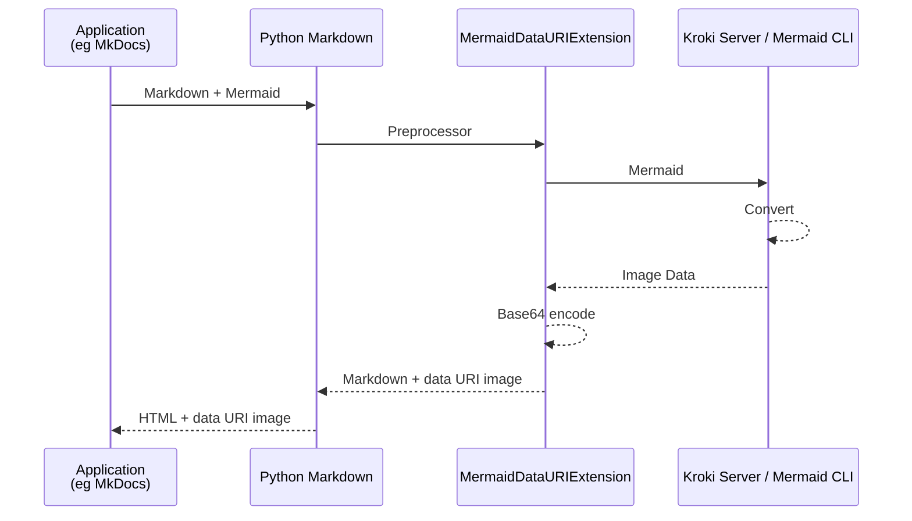

# markdown-mermaid-data-uri

[Mermaid][mermaid] extension for [Python-Markdown][python-markdown] using [Kroki server][kuroki] or [Mermaid-CLI][mermaid-cli].

Mermaid code blocks are converted to SVG/PNG and treated as [data: URI][data-uri]. This allows for PDF generation with tools like [WeasyPrint][wasyprint] without the need for JavaScript, even during web browsing.

[mermaid]: https://mermaid.js.org/
[python-markdown]: https://python-markdown.github.io/
[kuroki]: https://kroki.io/
[mermaid-cli]: https://github.com/mermaid-js/mermaid-cli
[data-uri]: https://developer.mozilla.org/en-US/docs/Web/URI/Reference/Schemes/data
[wasyprint]: https://weasyprint.org/

## Install

```sh
pip install git+https://github.com/hkato/markdown-mermaid-data-uri.git
```

## Requirements (Mermaid engine)

### Access the Kroki server via the Internet

Default setting with no options.

### Self-hosting Kroki server (recommended)

ref. Kuroki.io > [Install](https://kroki.io/#install)

Here's a sample compose file.

```sh
docker compose up -d
```

### Mermaid CLI (recommended)

```sh
npm install @mermaid-js/mermaid-cli
```

## Usage

````python
import markdown
from markdown_mermaid_data_uri import MermaidDataURIExtension

markdown_text = """```mermaid
sequenceDiagram
    participant Alice
    participant Bob
    Bob->>Alice: Hi Alice
    Alice->>Bob: Hi Bob
```"""

html_output = markdown.markdown(
    markdown_text, extensions=[MermaidDataURIExtension(kroki_url='https://kroki.io', mermaid_cli=False)]
)

print(html_output)
````

```html
<p></p>
```

## MkDocs Integration

```yaml
# mkdocs.yml
markdown_extensions:
  - markdown_mermaid_data_uri
```

### Kroki server

```yaml
# mkdocs.yml
markdown_extensions:
  - markdown_mermaid_data_uri:
      kroki_url: http://localhost:8080/
```

### Mermaid CLI

```yaml
# mkdocs.yml
markdown_extensions:
  - markdown_mermaid_data_uri:
      mermaid_cli: true
```

## Diagram


